Utilizei esse artigo como referencia para estudo:
https://marraia.medium.com/utiliza%C3%A7%C3%A3o-do-keycloak-em-aplica%C3%A7%C3%B5es-net-6-0-4a787520c85b

Primeiramente Rodar o docker-compose

```
docker-compose up
```

Após subir o docker o portal do KeyCloak estará no link: http://localhost:8080

Coloque o usuário(**admin**) e senha(**admin**), para que possamos configurar os usuários que terão acesso a nossa aplicação.


# Passo a Passo

Primeiro, vamos criar um novo Realm

## **Realm** 
Refere-se a um agrupamento lógico/uma organização para a nossa aplicação de configurações de segurança, políticas de autenticação e autorização, usuários e clientes de aplicativos.

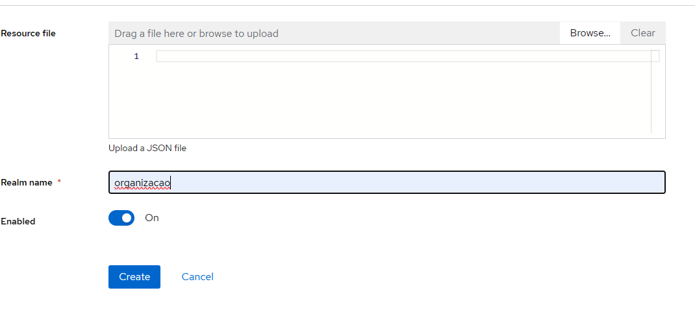

Agora, iremos criar um Client

# **Client** 
Se refere a um aplicativo ou serviço que deseja interagir com o servidor Keycloak para fins de autenticação e autorização. O client é uma entidade que está registrada no servidor Keycloak e representa o ponto de entrada para a autenticação de usuários, a obtenção de tokens de acesso e a implementação de Single Sign-On (SSO). 

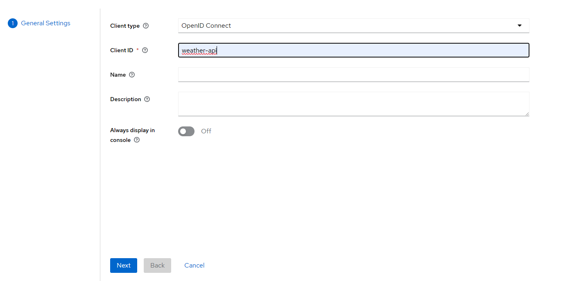

Na segunda tela, habilite a opção Client authentication e clique em Salvar.

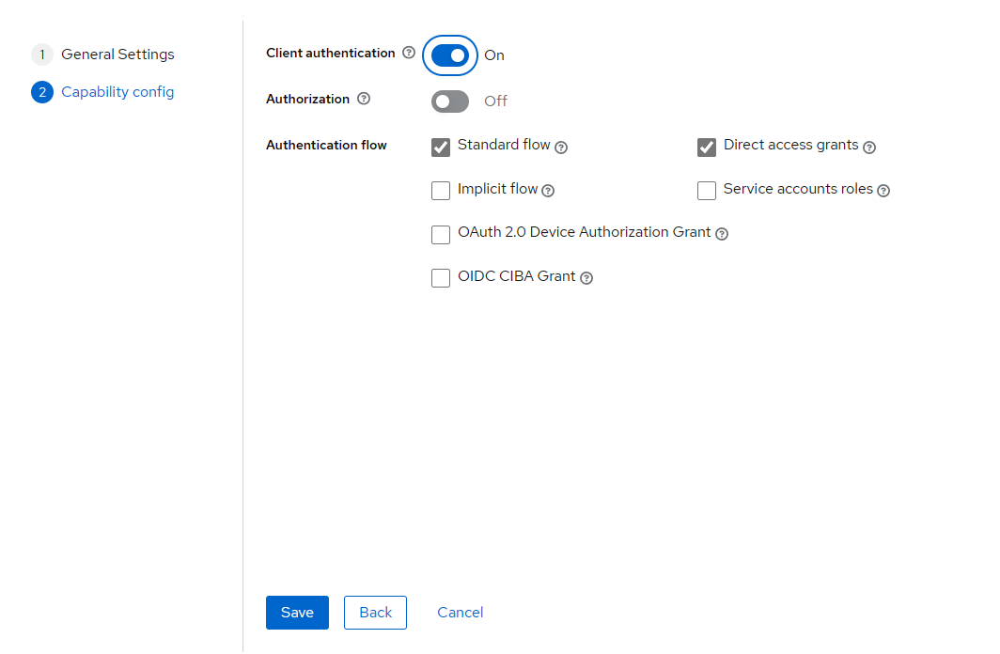

Seguindo com as configurações, precisamos criar um Client Scope, para que quando o usuário obter a autenticação ao KeyCloak, será gerado um token, e esse token deve ser enviado a aplicação, e a aplicação deverá validar se o token gerado, realmente foi gerado pelo servidor de autenticação, que no nosso caso é o KeyCloak.

# Client scopes

É uma configuração que define como um determinado conjunto de funcionalidades ou características específicas será disponibilizado para os clientes (aplicativos) registrados no servidor Keycloak. Os Client Scopes permitem que você defina conjuntos predefinidos de permissões, configurações de segurança e atributos de usuário que podem ser compartilhados por vários clientes, facilitando a padronização e a reutilização dessas configurações.

A ideia principal por trás dos Client Scopes é evitar a redundância na configuração de clientes. Em vez de configurar cada cliente separadamente com as mesmas configurações, você pode criar um Client Scope com essas configurações e, em seguida, associar o Client Scope a vários clientes. Quando você atualiza o Client Scope, todas as configurações relacionadas são propagadas para os clientes associados.

----

Clique no menu Client scopes, e depois clique em Create Client Scope.

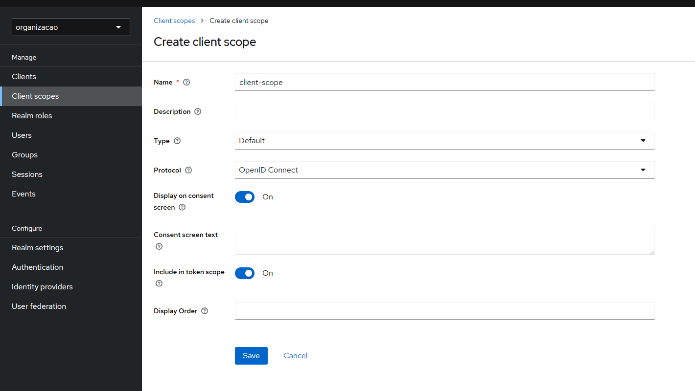

----

Clique em Salvar;

Depois disso, irá se habilitar duas novas abas: Mappers e Scope

Primeiro iremos criar um novo Mapper, clique na aba Mappers e clique em Create a new mapper

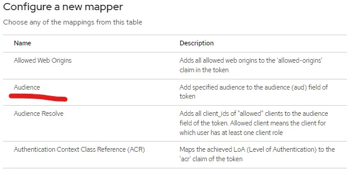

Clique na opção Audience, e depois coloque um nome e relacione o client api na opção Inclueded Client Audience.

# Audience

A audiência especifica para qual cliente ou aplicativo um token de acesso é válido e deve ser usado. Cada token de acesso emitido pelo Keycloak possui uma lista de audiências (valores aud) que indicam quais clientes ou serviços podem consumir o token.

Habilite a opção Add to access token e depois clique em Salvar;

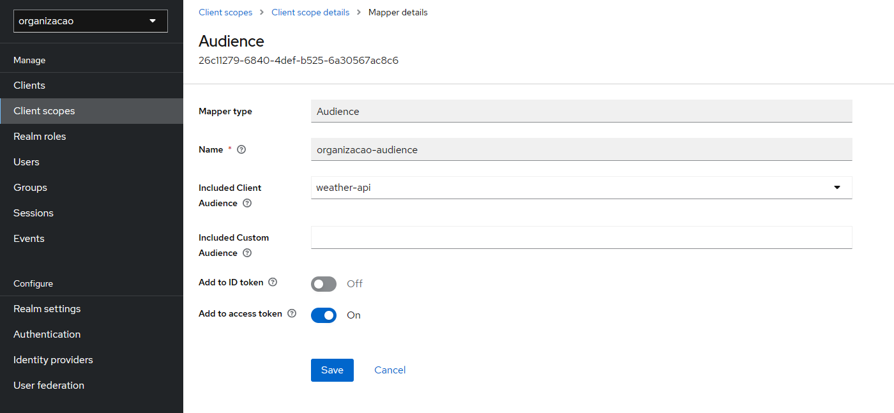

----

Agora clique novamente no menu Clients, vá até a aba Clients Scope e clique em Add Client Scope

Selecione o Client Scope criado anteriormente e clique em Add com a opção Default

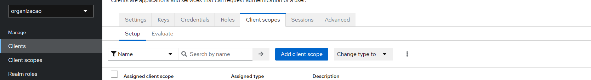

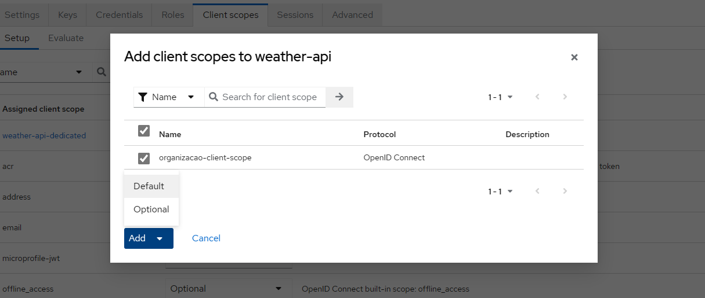

Agora, ainda no menu Clients no client api, clique na opção Action;

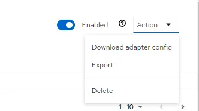

Clique na opção Download adapter config, irá aparecer essa janela

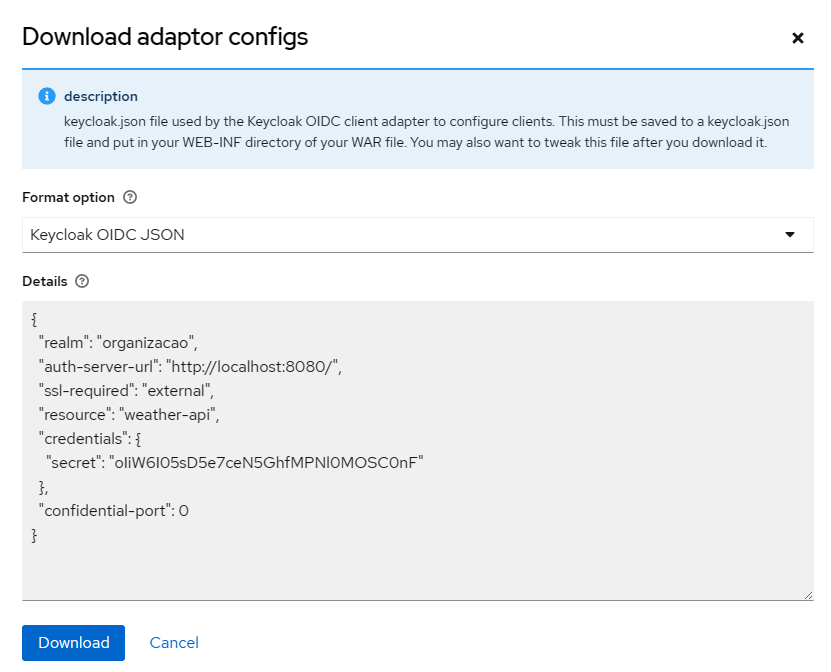

Copie o json que está no campo Details, pois iremos utilizar como configuração em nossa aplicação .Net 6.0;

----

## Usuários

Por fim, precisamos criar um usuário no KeyCloak, para que ele possa se autenticar;

Clique no menu Users, e clique em Create Users

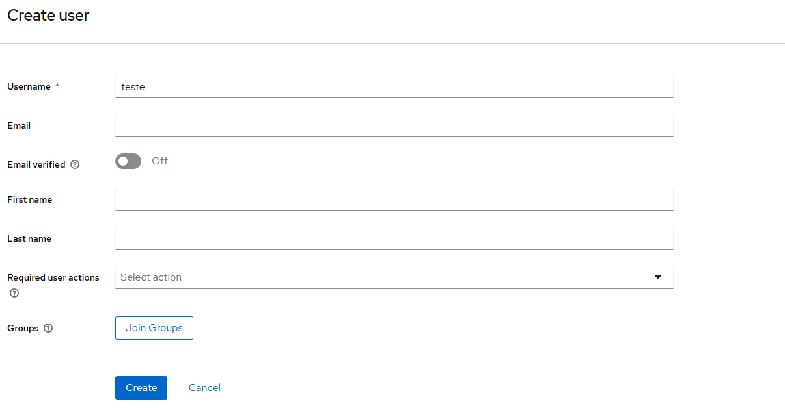

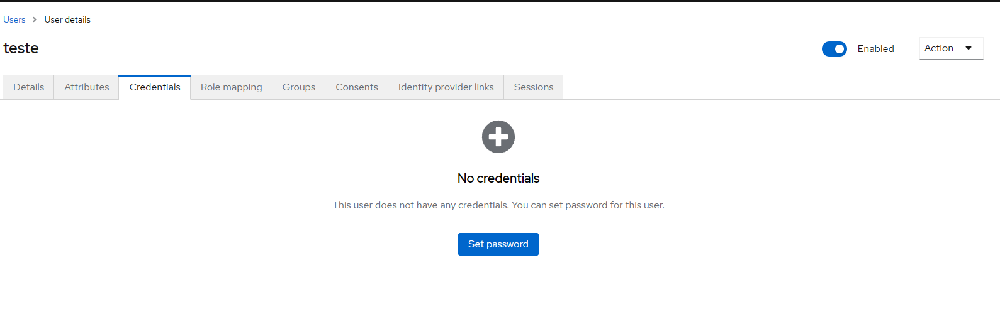

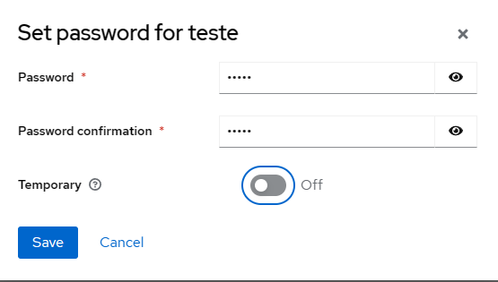